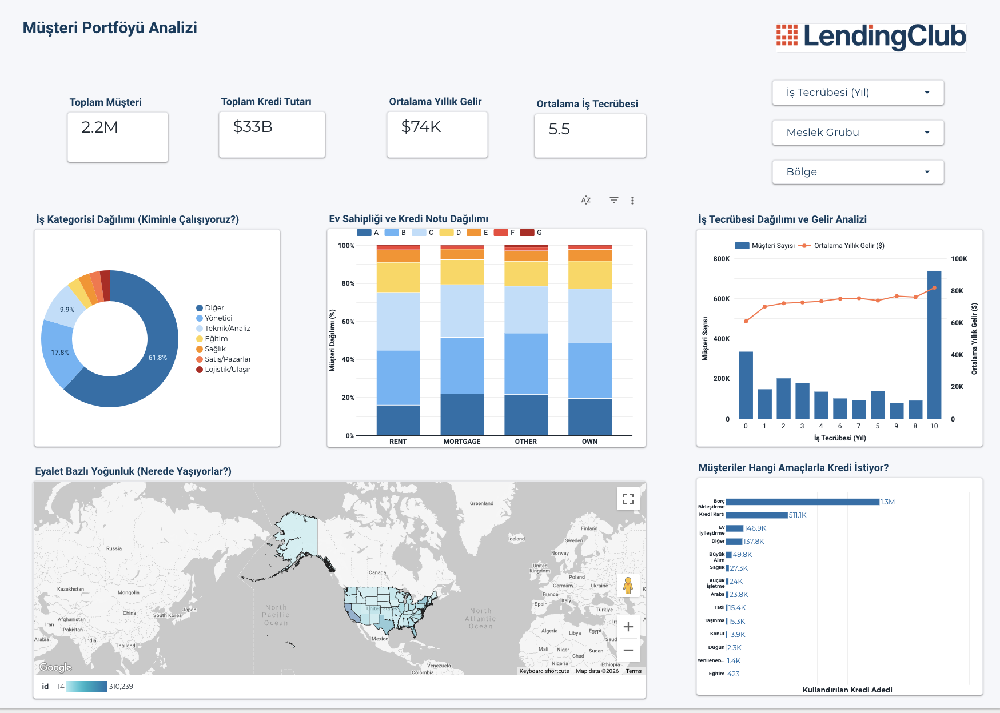
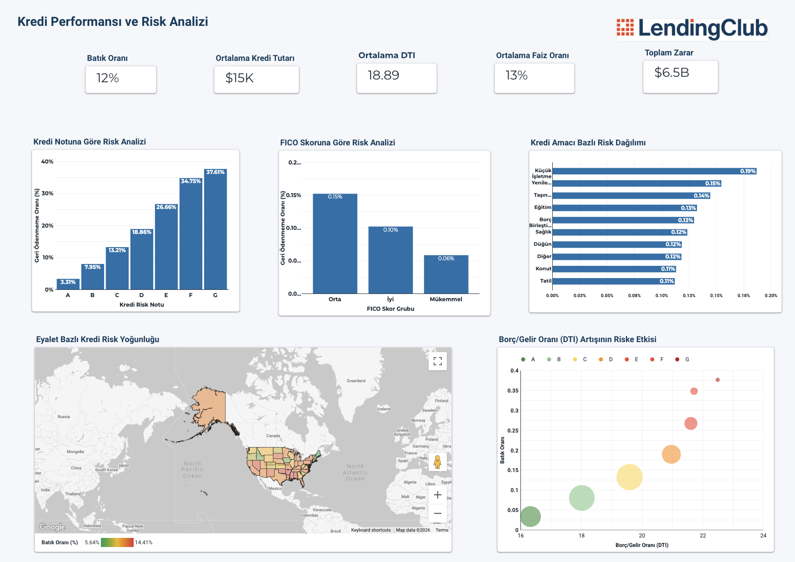

# Lending Club Credit Risk Analysis — End-to-End Decision Support System

This project delivers an end-to-end **Machine Learning + Business Intelligence** solution for credit risk management using **2.2M Lending Club loan records**.  
The workflow covers **data cleaning, BigQuery modeling, interactive Looker Studio dashboards, and ML-based risk scoring** to support lending decisions.

---

## Business Impact (ROI)

- **Loss Prevention:** $607.8M potential losses avoided from a total risk pool of $826.2M  
- **Net Financial Contribution:** $355.3M net profit after opportunity costs (false rejections)  
- **Risk Identification (Recall):** 73.6% of defaults detected before loan issuance  

---

## Tech Stack

- **Data Science / ML:** Python (Pandas, NumPy, Scikit-learn, XGBoost), Matplotlib  
- **Data Warehousing:** Google BigQuery (SQL)  
- **Business Intelligence:** Looker Studio  
- **Environment:** Google Colab  

---

## Notebook (Colab / ML)

**LendingClub_ML.ipynb**

---

## Project Workflow (End-to-End)

### 1. Data Cleaning & Preparation (Colab / Python)
Core data cleaning, feature engineering, and exploratory data analysis (EDA).

### 2. Data Modeling (BigQuery / SQL)
Additional cleaning checks, ID-based joins, and analysis-ready views for BI.

### 3. Dashboarding (Looker Studio)
Connected BigQuery views to Looker Studio and embedded EDA + model outputs.

### 4. Machine Learning (Colab)
Built classification models to predict default risk with business-oriented ROI framing.

---

## Analytical Highlights

### Statistical Evidence & EDA
- **Chi-Square Test:** Strong dependency between Loan Grade and repayment performance (p < 0.001)  
- **T-Test:** Defaulted loans have higher average interest rates (15.72%) than paid loans (12.63%)  
- **Pearson Correlation:** Strong inverse relationship between FICO score and interest rate (-0.40)  

### Machine Learning Pipeline
- **Model:** XGBoost for non-linear financial patterns  
- **Class Imbalance:** Cost-sensitive learning with higher weight on “Default”  
- **Interpretability:** Feature importance (e.g., Grade A as a dominant signal)  

### Real-Time Decision Simulation
- High-income but risky profiles can be rejected  
- Lower-income but reliable profiles can be approved based on risk score  

---

## Looker Studio Dashboards

Main reporting layers:

- **Customer Portfolio:** Client distribution and financial indicators  
- **Risk Analysis:** Default rate, credit loss, and risk drivers  
- **Risk Segmentation:** Risk by occupation and employment length  
- **Debt Health:** DTI analysis and impact on default probability  

**Dashboard (View-only):**  
https://lookerstudio.google.com/reporting/3e264e91-b533-4840-a1ef-cc72908f1906  

---

## Repository Structure

- **notebooks/** — Colab notebooks (data prep + ML)  
- **sql/** — BigQuery SQL scripts  
- **images/** — Dashboard and model visuals  

---

## Key Recommendations

- **Automatic Rejection / Collateral:** Grade F–G applications (default rate > 50%)  
- **Dynamic Pricing:** Adjust interest rates using model-based risk scores  

---

## Dashboard Preview

  
  
  

